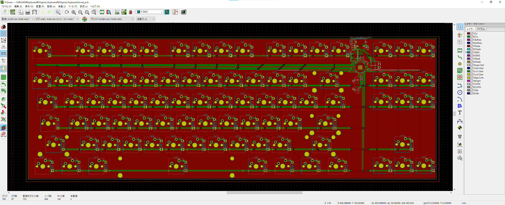
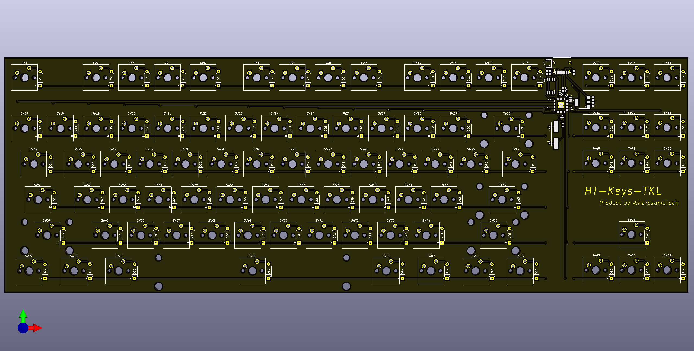

# console.log('Hello-World')

Jekyllなんも分からん  
GitHub Pagesなんも分からん

# 自己紹介

日本のどこかにいる、割となんでもやってる学生です  
Twitter：<https://twitter.com/HarusameTech>

# 活動

## 基板設計

- オリジナル自作キーボード基板「HT-Keys-TKL」

8 セット程度頒布予定です。ご相談やご質問等ございましたら DM 頂ければ対応いたします。お気軽にお寄せください
