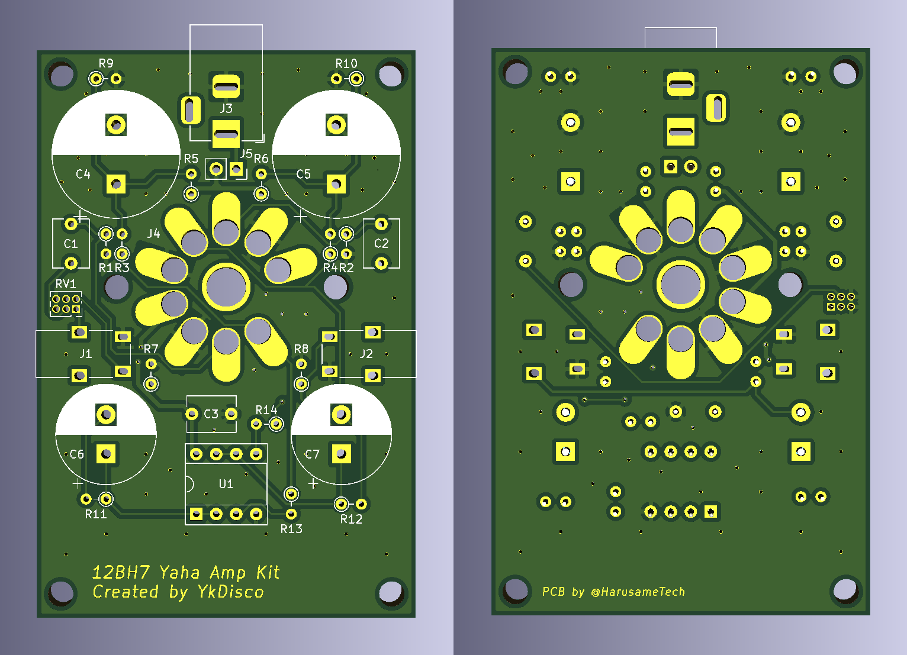

# console.log('Hello-World')

このサイトは私の自己紹介兼ポートフォリオサイトです。GitHub Pages でホスティングしています

# 自己紹介

日本のどこかにいる、割となんでもやってる学生です  
なんちゃって低 Layer エンジニア  
回路・基板設計や組み込みプログラム作成を趣味でやってます

## リンク集

Twitter：<https://twitter.com/HarusameTech>  
GitHub：<https://github.com/Riku-mc>  
Misskey：<https://misskey.io/@Haru32768>  
物販：<https://harusametech.booth.pm/>  
サイト：<https://www.harusame.tech/>  
干し芋：<https://www.amazon.co.jp/hz/wishlist/ls/1FH3A365JT0D2>

# 活動

## 基板設計

- オリジナル自作キーボード基板「HT-Keys-TKL」の基板を設計

8 セット程在庫ございます。Booth までどうぞ。ご相談やご質問等ございましたら DM 頂ければ対応いたします。お気軽にお寄せください  
<https://harusametech.booth.pm/items/4568322>

詳細：<https://www.harusame.tech/product/keyboard/HT-Keys>

- 「ゆっくりでぃすこ」さんのキットの試作基板の設計

真空管アンプ用のキット基板だそうです。試作品のみ設計をさせていただきました。実際にキットとして販売されているものは御本人で設計されております。そのため、実際の見た目とは異なります  
頒布品リンク：<https://booth.pm/ja/items/4529946>

簡単なものでしたら依頼もお受けしています。相談等お気軽にどうぞ
