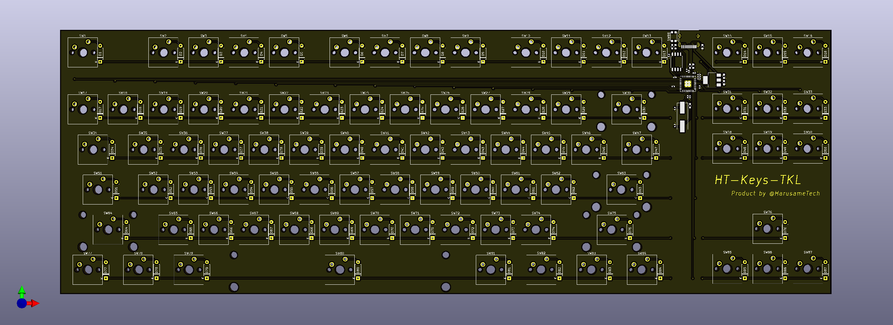
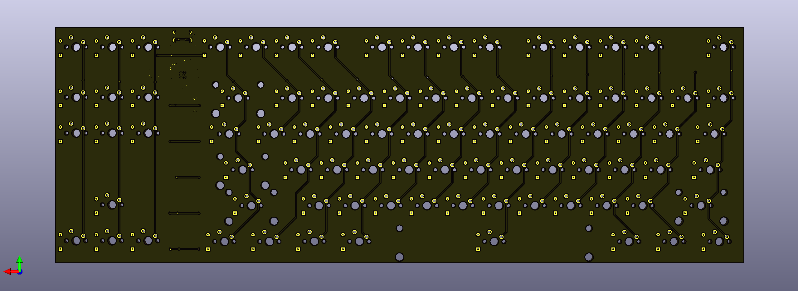
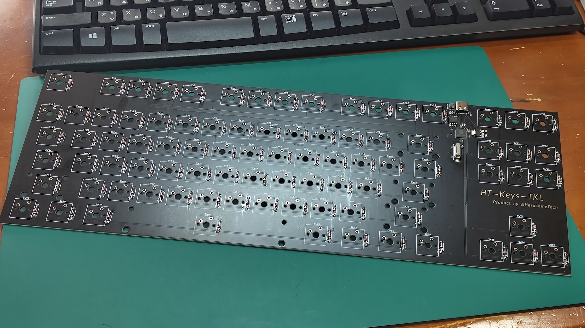
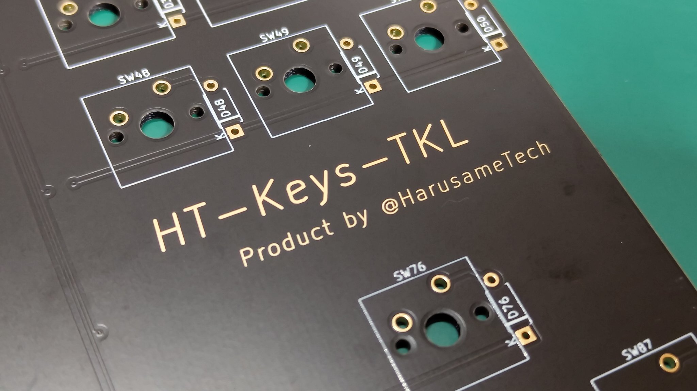
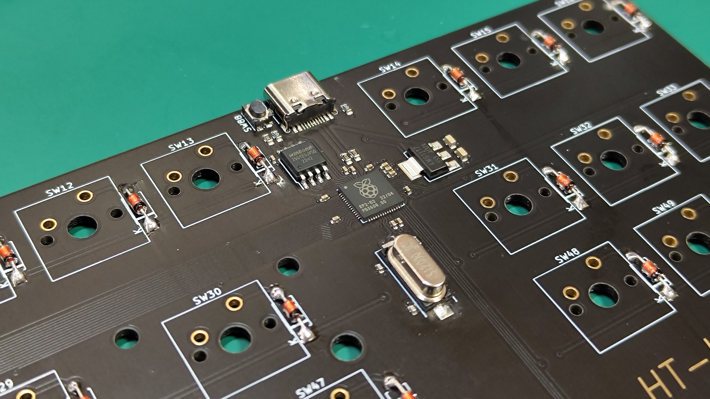

# HT-Keys

Q：HT-Keys とは？  
A：わたくしが設計・製造している自作キーボードシリーズです

## TKL

### 概要

- US 配列
- テンキーレス
- 全 87 キー
- USB Type-C インターフェース採用
- CherryMX プロファイル
- RP2040 搭載
- Raspberry Pi Pico 互換仕様
- ファームウェアレベルでカスタマイズ可能

### 画像ギャラリー

#### CAD イメージ

#### 実物写真

